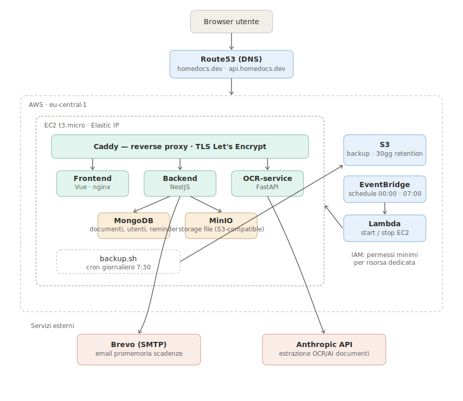

# Homedocs

Web app per gestire i documenti di casa di un nucleo familiare: visite mediche
con pagamenti, referti, documenti della casa, documenti auto, bolli e
scadenze — tutto in un unico posto, condiviso con la famiglia o tenuto
privato, a scelta.

**Produzione**: [homedocs.dev](https://homedocs.dev)

**Guida per chi la usa** (non tecnica): [`docs/GUIDA-UTENTE.md`](docs/GUIDA-UTENTE.md).

## Cosa fa

- **Documenti privati o condivisi**: ogni documento nasce visibile solo a chi
  lo carica; diventa condiviso con la famiglia solo se il proprietario lo
  decide esplicitamente.
- **Estrazione automatica dei dati (OCR/AI)**: carichi un PDF o una foto,
  Claude estrae i dati rilevanti (importi, scadenze, targhe, intestatari...)
  e li salva strutturati sul documento.
- **Promemoria scadenze**: email automatiche a 30/15/7 giorni dalla scadenza
  di un documento (bolli, assicurazioni, revisioni...).
- **Gestione famiglia**: un household con più membri, ruoli admin/membro,
  invito tramite codice.
- **Documenti auto**: una vista dedicata per veicolo con le relative scadenze.
- **Pagamenti**: importo, data e stato di pagamento associabili ai documenti
  che lo prevedono (es. visite mediche).

## Stack

| Livello | Tecnologia |
|---|---|
| Frontend | Vue.js 3 (Composition API) + TypeScript + Vite + Tailwind CSS 4 |
| Backend core | NestJS (Node/TypeScript) + Mongoose |
| Servizio OCR/AI | Python + FastAPI + Claude API |
| Database | MongoDB |
| Storage file | MinIO (S3-compatible) |
| Auth | JWT + refresh token |
| Reverse proxy / TLS | Caddy (Let's Encrypt automatico) |
| Infrastruttura | Terraform su AWS (EC2 + S3 + Lambda + EventBridge + Route53) |

## Struttura del repo

```
homedocs/
├── apps/
│   ├── frontend/          # Vue.js 3 — CLAUDE.md specifico
│   ├── backend/            # NestJS — CLAUDE.md specifico
│   └── ocr-service/        # Python/FastAPI — CLAUDE.md specifico
├── packages/
│   └── shared-types/       # Tipi TypeScript condivisi (DTO) tra frontend e backend
├── infra/
│   ├── terraform/          # Provisioning AWS (EC2, S3 backup, Lambda scheduler)
│   ├── ec2-scheduler/      # Lambda per lo spegnimento/accensione notturno
│   ├── backup.sh           # Backup giornaliero Mongo+MinIO su S3
│   └── restore.sh          # Ripristino dall'ultimo backup S3 (dopo ricreazione istanza)
├── docs/
│   ├── HomeDocs-Project-Spec.md   # Spec di progetto completa
│   └── design/                     # Mockup e riferimenti visivi
├── docker-compose.yml       # Stack di sviluppo
├── docker-compose.prod.yml  # Stack di produzione (Caddy, build multi-stage)
├── Caddyfile                # Reverse proxy di produzione
└── CLAUDE.md                # Contesto per Claude Code
```

Ogni sotto-app ha il proprio `CLAUDE.md` con dettagli architetturali e
convenzioni specifiche — consultalo prima di lavorare su una singola app.
Il documento di riferimento completo per modello dati, roadmap e regole di
privacy è `docs/HomeDocs-Project-Spec.md`.

## Sviluppo locale

Richiede Docker e Docker Compose.

```bash
cp .env.example .env
# valorizza almeno ANTHROPIC_API_KEY se vuoi testare l'estrazione OCR reale

docker compose up -d
```

- Frontend: http://localhost:5173
- Backend: http://localhost:3000
- OCR service: http://localhost:8000
- MinIO console: http://localhost:9001
- Mailpit (email di sviluppo): http://localhost:8025

## Test

```bash
cd apps/backend && npm test    # Jest, 22 test
cd apps/frontend && npm test   # Vitest, 12 test
```

Entrambi girano in CI ad ogni push.

## Produzione

Lo stack di produzione (`docker-compose.prod.yml`) aggiunge Caddy come
reverse proxy con TLS automatico e rimuove ogni porta pubblica non
strettamente necessaria (solo 80/443 esposte). Vedi
[`infra/README.md`](infra/README.md) per il provisioning AWS via Terraform,
il backup automatico e lo spegnimento notturno dell'istanza — e la sezione
"Architettura AWS" più sotto per una vista d'insieme.

Deploy aggiornamenti:
```bash
git pull
docker compose -f docker-compose.prod.yml up -d --build
```

## Architettura AWS

L'infrastruttura di produzione è interamente definita in
[`infra/terraform/`](infra/terraform/) (Infrastructure as Code, non creata a
mano in console). Vista d'insieme:



- **Route53**: registra il dominio `homedocs.dev` e ne gestisce i record DNS
  (`homedocs.dev`, `api.homedocs.dev` e `storage.homedocs.dev` → Elastic IP
  dell'istanza).
- **EC2 (`t4g.micro`, Graviton/arm64)**: unica istanza che ospita l'intero
  stack applicativo via Docker Compose — Caddy, frontend, backend,
  ocr-service, MongoDB, MinIO. Scelta deliberata: per un carico da 2-4
  persone, un'istanza singola con Compose è più semplice ed economica di
  ECS/Fargate + servizi gestiti, pur restando interamente riproducibile da
  codice. Su ARM le immagini costano ~25% in meno a parità di risorse; il
  `user_data.sh` predispone 2 GB di swap (la RAM da 1 GB non basta per il
  build in loco delle immagini) e installa Docker + AWS CLI.
- **Caddy** (dentro l'istanza): unico servizio con porte pubbliche (80/443),
  termina TLS con certificati Let's Encrypt automatici e instrada il
  traffico ai container interni. Espone tre host: il frontend, l'API backend
  e `storage.homedocs.dev` → MinIO (necessario perché il browser apre gli URL
  firmati dei file). Nessun altro servizio ha porte esposte all'esterno.
- **EventBridge Scheduler + Lambda**: due schedule (00:00 e 07:00
  Europe/Rome) invocano una Lambda che ferma/avvia l'istanza EC2, per
  ridurre le ore fatturate senza rinunciare a un'architettura sempre-Docker.
- **S3**: bucket dedicato ai backup giornalieri (`mongodump` + dati MinIO),
  con retention di 30 giorni, scritto dall'istanza tramite un instance
  profile IAM (nessuna credenziale statica). Un cron (`infra/backup.sh`) gira
  alle 08:00; dopo una ricreazione dell'istanza il DB riparte vuoto e si
  ripristina con `infra/restore.sh`.
- **IAM**: ruoli con permessi minimi e mirati — la Lambda può solo
  start/stop quella specifica istanza, l'instance profile EC2 può solo
  scrivere sul bucket di backup.

Servizi esterni ad AWS: **Brevo** per l'invio delle email di promemoria
scadenze via SMTP, **Anthropic API** per l'estrazione OCR/AI dei documenti.

## Licenza

Progetto privato, uso familiare.
